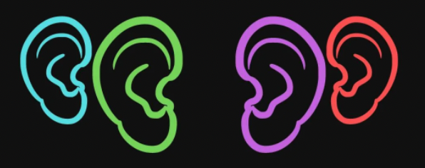

<p align="center"></p>

<h2 align="center">Release Listener</h2>

<!---Esses são exemplos. Veja https://shields.io para outras pessoas ou para personalizar este conjunto de escudos. Você pode querer incluir dependências, status do projeto e informações de licença aqui--->

> Do you need to be aware of new releases/updates from your project's dependencies and critical fixes? Yes all of us, concerned developers take care of this kind of `unplanned task`. To save your time a little bit more, you can use the `RELEASE NOTIFIER` by adding the project repo into your config and getting notified about them. Enjoy! :upside_down_face:  

## Basic Usage

* Create the listen file ```config/listen.json```
```json
{
    "listeners": [
        {
            "type": "GITHUB",
            "listen": [
                "RELEASES",
            ],
            "from": "https://github.com/kubernetes/kubernetes",
        },
    ]
}
```

#### Listener Types

* `GITHUB` `GITLAB`

#### Listen Actions

* `RELEASES` `TAGS`

## 💻 Install

Antes de começar, verifique se você atendeu aos seguintes requisitos:
<!---Estes são apenas requisitos de exemplo. Adicionar, duplicar ou remover conforme necessário--->

## 🚀 Run 

```
<comando_de_instalação>
```

## 📫 Missing your source notifier? Please, contributes!

Read the [contributing guide](CONTRIBUTING.md)

## 📝 License

This project is under license. See the [LICENSE](LICENSE.md) file for more details.

[⬆ Back to top](#release-listener)<br>